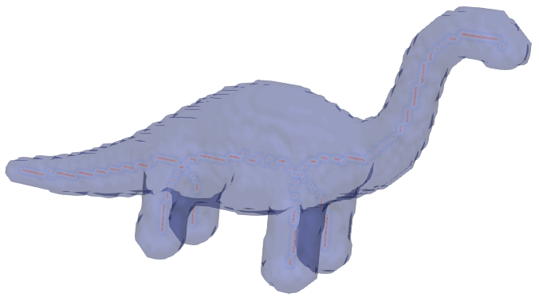

# Introduction
Tools related to skeletonization of objects. 
The codes requires the [ITK](https://itk.org/) library to work and `CMake` to build.
# Compilation
* Create a build directory for compilation
```bash
$ mkdir build
```
* Set the `ITK_DIR` variable inside the `CMakeLists.txt`. 
The exact path will depend on the location where ITK is installed on your machine.
Run following command (with appropriate `path/to/ITK`) to set the variable.
```bash
$sed -i '10s/.*/set(ITK_DIR \/path\/to\/ITK)/' CMakeLists.txt
``` 
* Change into the build directory and generate make files using cmake
```bash
$ cd build
$ cmake -DCMAKE_BUILD_TYPE=Release ..
```
* Compile using `make`
```bash
$ make -j2
```
If all goes well you should now have `skeltools` executable insed the build folder.

# Computing Object Centerline.
To compute (boundary distance weighted) medial curve for `dinosaur` sample image run
```bash
$ skeltools -priority distance -curve -input data/dinosaur.tif -smooth 0.2  -fillholes -outputFolder results
```
If everything runs without errors you should see `dinosaur_distance_curve.tif` inside `results` folder.

<figure style="display:block; margin: 0 auto; text-align: center; width:600px">

<figcaption>Sample dinosaur object in translucent blue with reddish colored medial curve inside</figcaption>
</figure>
