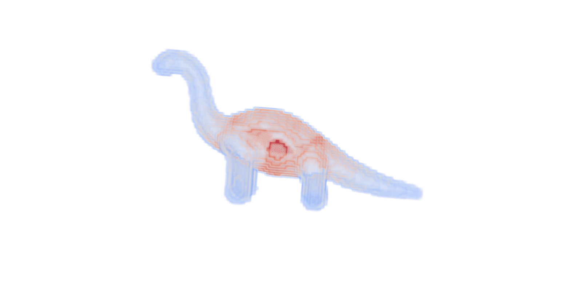

# Introduction
Tools related to skeletonization of objects. 
The codes requires the [ITK](https://itk.org/) library to work and `CMake` to build.
# Compilation
* Create a build directory for compilation
```bash
$ mkdir build
```
* Set the `ITK_DIR` variable inside the `CMakeLists.txt`. 
The exact path will depend on the location where ITK is installed on your machine.
Run following command (with appropriate `path/to/ITK`) to set the variable.
```bash
$sed -i '10s/.*/set(ITK_DIR \/path\/to\/ITK)/' CMakeLists.txt
``` 
* Change into the build directory and generate make files using cmake
```bash
$ cd build
$ cmake -DCMAKE_BUILD_TYPE=Release ..
```
* Compile using `make`
```bash
$ make -j2
```
If all goes well you should now have `skeltools` executable insed the build folder.

# Computing object centerline.
To compute (boundary distance weighted) medial curve for `dinosaur` sample image run
```bash
$ skeltool -priority distance -curve -input data/dinosaur.tif -smooth 0.2  -fillholes -outputFolder results -anchor aof
```
If everything runs without errors you should see `dinosaur_distance_curve.tif` inside `results` folder.

<figure style="display:block; margin: 0 auto; text-align: center; width:600px">

<figcaption>Sample dinosaur object in translucent blue with reddish colored medial curve inside</figcaption>
</figure>

# Computing object medial surface
To compute medial surface for `dinosaur` sample image run
```bash
$ skeltool -priority distance -surface -input data/dinosaur.tif -smooth 0.1  -fillholes -output results/dino_surface.tif -anchor aof
```
The output of the above command should be the medial surface `dino_surface.tif` inside the `results` folder.
<figure style="display:block; margin: 0 auto; text-align: center; width:600px">

<figcaption>Sample dinosaur object in translucent blue with reddish colored medial surface inside</figcaption>
</figure>

# Mapping object thickness to object boundary
`MapToBoundaryImageFilter` can be used to map features (for example object width) from medial surface to the object boundary. Example 
`map-medial-thickness-to-boundary.cpp` computes object width weighted medial skeleton of `dinosaur.tif' and maps it back to 
the boundary.
<figure style="display:block; margin: 0 auto; text-align: center; width:600px">

<figcaption>Visualization of object thickness to object boundary for dinosaur sample image</figcaption>
</figure>

## References

<a id="1">[1]</a> Siddiqi, K., Bouix, S., Tannenbaum, A., & Zucker, S. W. (2002). Hamilton-jacobi skeletons. International Journal of Computer Vision, 48, 215-231.

<a id="2">[2]</a> Dimitrov, P., Damon, J. N., & Siddiqi, K. (2003, June). Flux invariants for shape. In 2003 IEEE Computer Society Conference on Computer Vision and Pattern Recognition, 2003. Proceedings. (Vol. 1, pp. I-I). IEEE.

<a id="3">[3]</a> Siddiqi, K., & Pizer, S. (Eds.). (2008). Medial representations: mathematics, algorithms and applications (Vol. 37). Springer Science & Business Media.